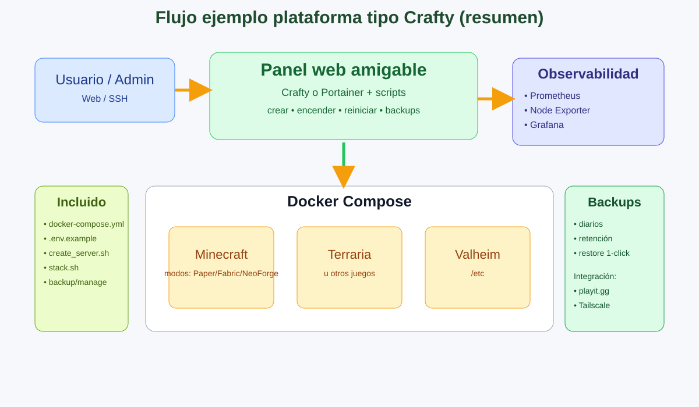

# Uso del proyecto (ordenado y funcional)

## Ejemplo visual de flujo

La siguiente imagen resume el flujo recomendado del proyecto (usuario → panel → contenedores → observabilidad/seguridad/backups):



> Si quieres usar tu imagen personalizada, reemplaza `docs/assets/flujo_ejemplo.svg` por tu PNG/JPG y conserva el mismo nombre.

## Estructura

- `docker-compose.yml`: servicios principales con perfiles.
- `.env.example`: plantilla de configuración.
- `scripts/create_server.sh`: crea configuración de servidor.
- `scripts/stack.sh`: levanta/baja stack con modo Crafty o no-Crafty.
- `scripts/optimize_server.sh`: aplica perfil de optimización.
- `scripts/manage_server.sh`: comandos admin Minecraft.
- `scripts/backup.sh`: backup con retención.
- `scripts/ha_event.sh`: eventos hacia Home Assistant.
- `scripts/validate_project.sh`: chequeo integral del proyecto.

## Flujo recomendado

1. Validar dependencias:
   ```bash
   scripts/check_dependencies.sh
   ```
2. Crear servidor:
   ```bash
   scripts/create_server.sh mc-survival PAPER 6G 25565 nocrafty
   ```
3. Optimizar:
   ```bash
   scripts/optimize_server.sh balanced
   ```
4. Levantar stack:
   ```bash
   scripts/stack.sh up nocrafty
   ```
5. UI Esqueleto (visualización/administración):
   ```bash
   # al levantar modo nocrafty
   # abrir: http://localhost:8088
   ```
6. Comandos admin:
   ```bash
   scripts/manage_server.sh op TuUsuario
   scripts/manage_server.sh give TuUsuario diamond 16
   ```

## Modos

- `crafty`: activa panel Crafty.
- `nocrafty`: activa Portainer como panel ligero.

## Compatibilidad de nombre

El nombre de servidor debe cumplir: `^[a-z0-9-]+$`
